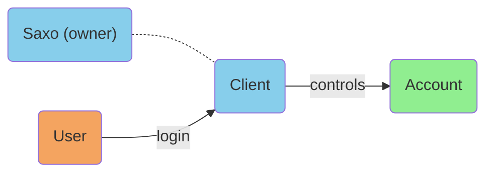
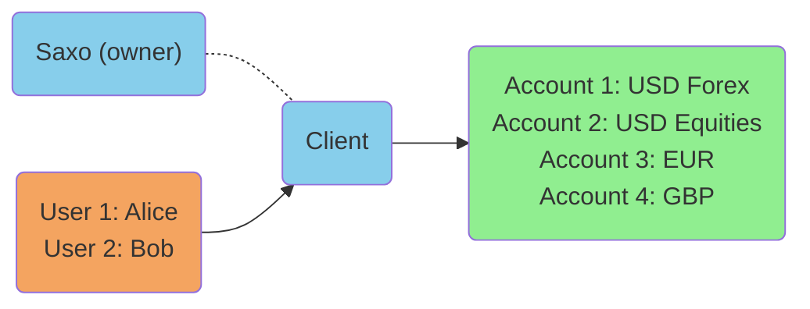
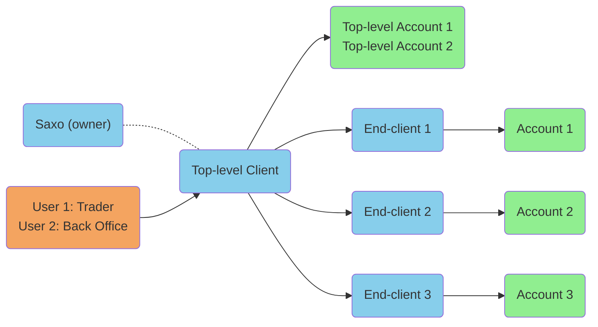

# The Client-User-Account Model

??? abstract
    Three key elements make up Saxo's internal hierarchy model: the user, client, and account. These entities are at the basis of all OpenAPI endpoints and functions, and distinct business logic and rules apply to each entity differently.

---

The OpenAPI is designed around Saxo's core client structure, and the provided functionality inherits many features from the underlying model. To understand the different aspects of the environment that contains client information and the business logic that applies on different levels across this environment, it is important to consider that Saxo's systems are organized in a *hierarchical* model. This model generally applies to *any* client and the accounts they hold with Saxo. Aggregation always 'flows up' in this hierarchy and ultimately ends at the top level, which can be a single client or an owner of multiple clients.

## Three Key Entities

Three entities make up this environment: the **Client**, **Account**, and **User**. Generally speaking, a client:

- has a user or multiple users that are allowed to log into this client and act on this client's behalf in varying capacities,
- owns one or more accounts (possibly with differing configuration) that operations can be applied to, and
- (optionally) owns underlying clients that it has control over, enabling hierarchical structures.

The most straightforward case is that of a direct client, which is a single client entity owned by Saxo[^1] (both are blue in the diagram below) with one authorized user (orange), which has full access to the sole account (green) that this client owns:

[^1]: Every client is, through multitude hierarchies, eventually always owned by a Saxo entity, either the head office or a local subsidiary.

A client can have more than 1 account linked to it and more than a single user that is allowed to access the client, for instance if the client is set up as a joint account and has accounts in multiple currencies or for different instrument types:

A client can also own clients itself, which yields a hierarchy. The owner is known as the 'top-level client', which has privileges over the accounts of the clients below it, such as being able to view their accounts or place orders on them. In the below schema, the users coupled to the end-clients are omitted for brevity.

## Characteristics

### User

This entity is an access entity with a unique username and password associated to a specific client. Normally a client has a single associated user, but in case of shared accounts or a power-of-attorney setup, a client can have multiple authorized users. Business logic that is applied on the user level:

- Purchasable subscriptions for real-time market data, which are tied to individual users (*not* to the client).
- Access to (a specific subset of) trading applications and tools, which is controlled by user-specific configuration.
- Operations that users are allowed to perform on accounts linked to the associated client and accounts linked to clients that a top-level client has access to, which is controlled by user roles.

### Client

This entity is a core entity that constitutes a taxable person or organization (legal entity). It represents the default 'node' of aggregation, which is known as a 'portfolio calculation entity'. Business logic that is applied on this level:

- The base currency is set on the client and is the main aggregation currency for all accounts owned by this client. Accounts and positions on accounts that are not in default currency are converted in real-time.
- Margin exposure is calculated and managed on the client level, taking into consideration all leveraged products in the accounts that the client owns. In some cases, margin calculation can also be tied to an individual account or a group of accounts (see below).
- General instrument access is controlled on this level, which affects the instruments that associated accounts can trade in.

### Account

A client always has one or more linked accounts, which are legal entities in themselves. Operations such as trading, funding, requesting quotes, etc. are all performed at the account level. While margin is calculated on the client level, all bookings making up the margin occur on the account level and all collateral and credit lines are associated to specific accounts. Business logic present on this level:

- Beyond normal trading accounts, a client may have specialized accounts for commissions, multi-currency settlement, DMA trading, IRAs, ISAs, AutoTrading, etc.
- Accounts may be set up for individual margin calculation, overriding the normal client level calculation.
- Accounts may restrict the instrument types that can be traded on them, and clients can have separate accounts associated to individual instrument types.
- Accounts may be configured to perform currency conversion for executed trades at end-of-day rates or at execution time rates (which is the default).

## Special Entities

### Account Groups

One or more accounts can also be grouped together into an Account Group to manage margin exposure as a separate entity. This entity only exists as a portfolio calculation entity and does not represent a legal entity (it is a collection of legal entities, i.e. accounts). Account Groups may have specific margin requirements and stop out procedures, superseding the default client level calculations. Since no bookings occur on account groups directly, calculations on groups are always performed in the client's base currency.

### Partner Clients

A top-level client which has access to their own hierarchy of underlying clients is usually associated to partners of Saxo Bank such as white label partners or introducing brokers. This particular type of client has a specific setup that aggregates all the underlying clients' accounts at the top level, which allows the partner to control their aggregated margins, exposure, and other portfolio and risk management metrics.