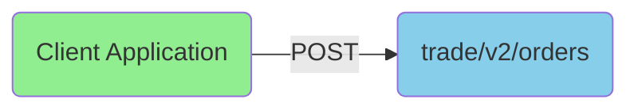

article_title: General Introduction to Order Placement

Orders are placed from the client application by sending a POST request to the OpenAPI endpoint: `trade/v2/orders`.



The `body` of the POST requests contains at minimum the following data:

```JSON
{
  "AccountKey": "[account key]",
  "Amount": "",
  "AssetType": "",
  "BuySell": "",
  "OrderType": "",
  "Uic": 0
}
```