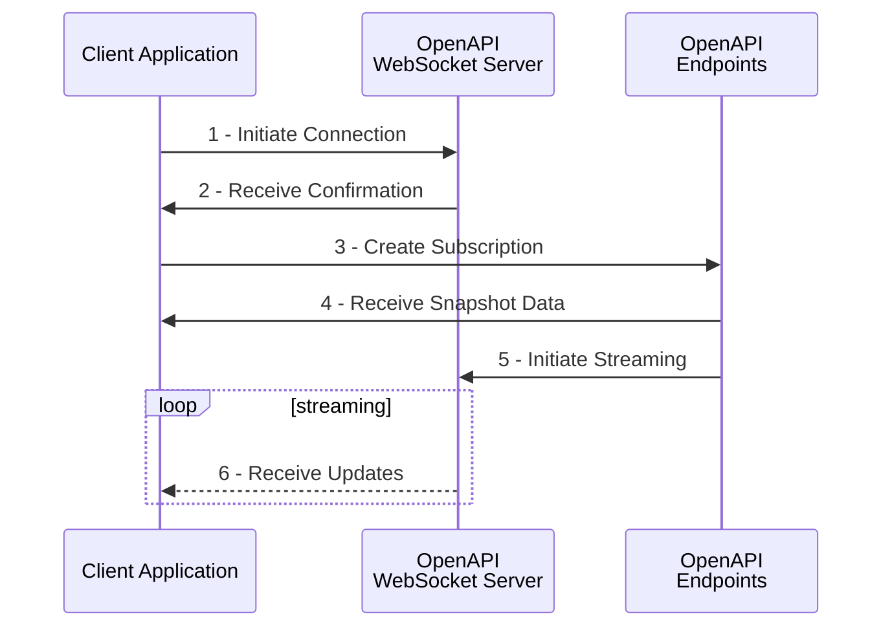

article_title: WebSocket Streaming

??? abstract
    This article provides an in-depth walkthrough of the OpenAPI WebSocket implementation. It is recommended for anyone working on OpenAPI streaming to study the below carefully, as it includes important considerations around correct management of WebSocket connections and optimal use of this solution.

## Introduction

The OpenAPI supports streaming using a standard implementation of the WebSocket Protocol, as described in [RFC6455](https://tools.ietf.org/html/rfc6455). Given that most of the information available to users is in constant flux (such as account balance, charts, quotes, position P&L, etc), using polling for *each* dynamic element that could be relevant in an application is not a viable solution. Instead, creating a single WebSocket connection and adding/removing subscriptions on-demand offers greatly reduced overhead and optimal latency.[^1]

In a standard use-case, an application (web, mobile, or native) creates a WebSocket connection and subscribes to the data that it requires. The subscriptions change constantly (depending on the contextual requirements) while the WebSocket connection persists. This allows for a fairly lean setup: the connection is created once (the 'channel'), and the data sent over this connection is controlled with individual `POST` and `DELETE` requests to the associated OpenAPI endpoints. The majority of endpoints support subscriptions alongside standard `GET` requests, which can be identified by the `.../subscriptions` suffix. Some examples:

- `port/v1/netpositions/subscriptions/`, which provides real-time updates of net positions across a client's accounts. This includes details such as `Exposure`, `ProfitLossOnTrade`, and `ConversionRateCurrent`, which is used to convert between instrument currency and account currency in real time.
- `chart/v1/charts/subscriptions/`, which is used to retrieve live OHLC data and (recent) historic bars, which lays the groundworks for interactive charts, indicators, strategies, etc.
- `trade/v1/infoprices/subscriptions/`, which is used to retrieve 'informational' prices for display purposes in product overviews, chart overlays, and watchlists. This endpoint also includes functionality to retrieve in-depth price details such as daily high/low and %-change values.

Depending on the specific context, an (imaginary) application might for instance follow the below sequence of OpenAPI operations while the user interacts with its UI:

1. When a user logs on, the app creates a WebSocket connection which will be used throughout the below steps.
2. While the UI loads, the app subscribes to `port/v1/balances/subscriptions/` to show the client an overview of their current account state. This is a persistent element in the UI and the subscription will be kept alive for as long as the client is using the app.
3. The app has a feature to draw charts, and the user selects the EURUSD Forex cross as the instrument for this chart. The app subscribes to `chart/v1/charts/subscriptions/` to simultaneously create a live-updating price stream and obtain historic bars.
4. The user switches to EURGBP in the chart. The app deletes the previous subscription as this is not longer required, and re-subscribes to `chart/v1/charts/subscriptions/` to pull out data for EURGBP.
5. The user closes the app. Any remaining subscriptions are removed and the WebSocket connection is closed.

Note that all data in the above example is transferred over a single persistent 'channel' (the WebSocket connection).


## Overview of WebSocket Streaming



The sequence above represents the standard flow to create a new WebSocket connection and subscribe to streaming data. It involves the following processes:

1. **Initiate Connection.** The client application creates a WebSocket connection by sending a request to the OpenAPI WebSocket Server (or 'streaming server', which is located on `streaming.saxobank.com`). This request, also called the 'opening handshake', follows [standard WebSocket protocol](https://tools.ietf.org/html/rfc6455#section-1.3) and includes two additional elements:

    - The `ContextId` parameter: a unique ID that identifies this connection. This ID is generated by the client application. Every API interaction that involves streaming should include this ID (see step 3 below). Example: `ContextId=MyApp123abc`. Make sure to create a sufficiently long random string to prevent potential clashes with other applications. The streaming server will respond with `HTTP 409 Conflict` if the ContextId is already used for a different connection.
    - The `Authorization` header: standard authorization header containing a valid access token. Can also be sent as parameter if the client-side library does not support initiating WebSocket connections with custom headers. Example: `Authorization=Bearer%20[token]`.

    ```HTTP tab="With Auth Header"
    GET /sim/openapi/streamingws/connect?ContextId=[ID] HTTP/1.1
    Host: streaming.saxobank.com
    Authorization: Bearer [token]
    Connection: Upgrade
    Upgrade: WebSocket
    Sec-WebSocket-Key: [auto-generated key]
    Sec-WebSocket-Version: 13
    ```

    ```HTTP tab="With Auth Parameter"
    GET /sim/openapi/streamingws/connect?ContextId=[ID]&Authorization=Bearer%20[token] HTTP/1.1
    Host: streaming.saxobank.com
    Connection: Upgrade
    Upgrade: WebSocket
    Sec-WebSocket-Key: [auto-generated key]
    Sec-WebSocket-Version: 13
    ```

    !!! caution
        In many client-side libraries, the URL that is required to initiate a WebSocket connection is usually composed as: `wss://host/path`, replacing the `http` protocol prefix (which is only used on initiation - the connection is upgraded afterwards).

        In JavaScript for example, initiating a WebSocket connection requires the following code:

        ```JavaScript
        let connection = new WebSocket("wss://example.com/streaming?parameter=123")
        ```

    !!! note
        The current WebSocket version supported by the OpenAPI is `13`. Client libraries using outdated versions will receive a `HTTP 426 Upgrade Required` response when attempting to connect to the streaming server.

2. **Receive Confirmation.** The streaming server responds with `HTTP 101 Switching Protocols` to confirm that the connection has been established. This response includes a `Connection: Upgrade` and a `Upgrade: websocket` header, as well as a hash of the key provided by the client in the `Sec-WebSocket-Accept` header, which prevents caching proxies from interfering with the opening handshake.

    ```HTTP
    HTTP/1.1 101 Switching Protocols
    Upgrade: websocket
    Connection: Upgrade
    Cache-Control: private
    Sec-WebSocket-Accept: [hashed key]
    ...
    ```

3. **Create Subscription.** At this point, a connection is established but no subscriptions have been created (the 'channel' is empty). In order to initiate a subscription, the client application sends a POST request to a `.../subscriptions` endpoint in the OpenAPI.[^2] For example, a price subscription for the EURUSD FX cross (UIC 21) can be created by sending the following POST request to the `trade/v1/infoprices/subscriptions/` endpoint:

    ```HTTP hl_lines="3 14 15"
    POST /sim/openapi/trade/v1/infoprices/subscriptions/ HTTP/1.1
    Host: gateway.saxobank.com
    Authorization: Bearer [token]
    Content-Type: application/json
    Accept: */*
    Cache-Control: no-cache
    Accept-Encoding: gzip, deflate
    Content-Length: 127
    {
      "Arguments": {
        "Uics": "21",
        "AssetType": "FxSpot"
      },
      "ContextId": "MyContextID",
      "ReferenceId": "SubscriptionReference"
    }
    ```

    Notice that this subscription request must contain a valid access token, and identifies the WebSocket connection using the `ContextId` field, which must match the ID set on the initial connection request (see step 1 above). This individual subscription is identified by its `ReferenceId`, which is set by the client application and can be used to adjust or cancel the subscription (without disconnecting the WebSocket). Note that each individual subscription must be created with a unique `ReferenceId` within the context of the WebSocket connection.

4. **Receive Snapshot Data.** The OpenAPI responds with `HTTP 201 Created` to signal that the client subscribed successfully. In the response to the subscription request, the OpenAPI sends out a snapshot of the current state of the data requested by the client application. This is the starting point of the subscription and it includes *all* available fields. The EURUSD price subscription for instance contains Bid/Ask prices and further details around the quote, such as `Amount`, which automatically defaults to 100K if it is not specified in the subscription request:

    ```JSON
    {
      "ContextId": "MyContextID",
      "Format": "application/json",
      "InactivityTimeout": 30,
      "ReferenceId": "SubscriptionReference",
      "RefreshRate": 1000,
      "Snapshot": {
        "Data": [
          {
            "AssetType": "FxSpot",
            "LastUpdated": "2020-02-11T09:38:20.553000Z",
            "PriceSource": "SBFX",
            "Quote": {
              "Amount": 100000,
              "Ask": 1.09143,
              "Bid": 1.09141,
              "DelayedByMinutes": 0,
              "ErrorCode": "None",
              "Mid": 1.09142,
              "PriceSource": "SBFX",
              "PriceSourceType": "Firm",
              "PriceTypeAsk": "Tradable",
              "PriceTypeBid": "Tradable"
          },
          "Uic": 21
          }
        ]
      },
      "State": "Active"
    }
    ```

5. **Initiate Streaming.** Behind the scenes, the OpenAPI automatically instructs the streaming server to start sending updates on the WebSocket connection for the newly-created subscription. These updates will be buffered if the subscription request is received before the WebSocket connection is created to ensure consistency on the client side.

6. **Receive Updates.** The client now receives data messages through the WebSocket connection. These messages are sent as a stream over a series of binary WebSocket frames. Each WebSocket frame can contain multiple data messages, and data messages can be split over several WebSocket frames, in which case a continuation frame follows. The `FIN` bit on each frame indicates whether the contained data completes a data message (see specification [here](https://tools.ietf.org/html/rfc6455#section-5.2)). Frame B in the below diagram only contains part of data message 3, which should be completed using the first half of frame C. Most client libraries handle these cases automatically without requiring additional configuration.

    ```
                        +---------------+-------------+-------------+
    WebSocket frame:    |   A     FIN=1 |   B   FIN=0 |   C   FIN=1 |
                        +-------+-------+-------------+-----+-------+
    Data message:       |   1   |   2   |         3         |   4   |
                        +-------+-------+-------------------+-------+
    ```

    The binary data contained in each data message needs to be decoded by the client application (see the byte layout below). The binary data includes the `RefrenceId` of the subscription that it the message belongs to. The payload of the data messages is always encoded in JSON format, which contains *only* fields that have changed since the previous message/initial snapshot (so-called **'delta updates'**).[^3] For instance, the first update message for the EURUSD price subscription created above could look like this:

    ```JSON
    [
      {
        "LastUpdated": "2020-02-11T09:38:30.972000Z",
        "Quote": {
          "Ask": 1.09148,
          "Bid": 1.09147,
          "Mid": 1.091475
        },
        "Uic": 21
      }
    ]
    ```

    Notice that the *only* static element in this message is the `Uic` field, which is required to determine which object should be updated on the client side. The updated fields are merged with the snapshot received in step 4 to create a new 'current state' of the EURUSD quote (see below). This operation is performed for every message received by the client.

    ```JSON hl_lines="11 15 16 19"
    {
      "ContextId": "MyConnectionID",
      "Format": "application/json",
      "InactivityTimeout": 30,
      "ReferenceId": "SubscriptionReference",
      "RefreshRate": 1000,
      "Snapshot": {
        "Data": [
          {
            "AssetType": "FxSpot",
            "LastUpdated": "2020-02-11T09:38:30.972000Z",
            "PriceSource": "SBFX",
            "Quote": {
              "Amount": 100000,
              "Ask": 1.09148,
              "Bid": 1.09147,
              "DelayedByMinutes": 0,
              "ErrorCode": "None",
              "Mid": 1.091475,
              "PriceSource": "SBFX",
              "PriceSourceType": "Firm",
              "PriceTypeAsk": "Tradable",
              "PriceTypeBid": "Tradable"
          },
          "Uic": 21
          }
        ]
      },
      "State": "Active"
    }
    ```


In the above overview, note that:

- A single WebSocket connection can serve multiple subscriptions, which are individually created and deleted when the context requires it.
- The WebSocket connection is exclusively used for listening to messages. Only the closing handshake requires the client app to send a message onto the connection to initiate the closing handshake. Any other messages sent by the client are ignored by the streaming server.


## Removing a Subscription

When a subscription becomes obsolete, for instance when the user has 'moved on' to a different section in the app's UI that does not require certain data to continue flowing, the app should perform cleanup. This prevents unnecessary overhead on the client and server side, and ensures that the session stays within throttling limits (see below). Subscriptions are created and deleted on the same path (in our example, `trade/v1/infoprices/subscriptions/`). For deletion, the `ContextID` and `SubscriptionReference` are added as path parameters:

```HTTP
DELETE /sim/openapi/trade/v1/infoprices/subscriptions/{ContextID}/{SubscriptionReference} HTTP/1.1
Host: gateway.saxobank.com
Authorization: Bearer [token]
```

The OpenAPI confirms deletion by returning `HTTP 202 Accepted`.

## Decoding Data Messages

The client application is expected to decode the byte layout of each individual message, which follows the below pattern:

| Byte index     | Size (bytes) | Description | Example value |
|----------------|--------------|-------------|---------------|
| 0              | 8            | **Message identifier** <br/> 64-bit little-endian unsigned integer uniquely identifying each message, starting at `1` for the first message. Can roll over or be reset during a session. | `31` |
| 8              | 2            | **Reserved** <br/> Reserved bytes for future use - to be ignored by the client application. | |
| 10             | 1            | **Reference ID size** `RefSize` <br/> Number of bytes that make up the Reference ID of the subscription that this message belongs to. | `15` |
| 11             | `RefSize`    | **Reference ID** <br/> ASCII-encoded Reference ID corresponding to the subscription that this message belongs to or to pre-defined control messages, which always start with an underscore `_` (see below). | `SubscriptionReference`  or `_heartbeat` |
| 11 + `RefSize` | 1            | **Payload format** <br/> 8-bit unsigned integer signaling the format of the payload. Value will be `0` for data messages and control messages to signal payload is a UTF-8 encoded text string containing JSON. | `0` |
| 12 + `RefSize` | 4            | **Payload size** `PlSize` <br/> 32-bit little-endian unsigned integer indicating the size of the payload contained in this message. | `108` |
| 16 + `RefSize` | `PlSize`     | **Message payload** <br/> UTF-8 encoded message payload, which decodes to a string representing a JSON object. This string should be deserialized into a JSON object by the client application. | *See update message above* |


## Disconnecting and Reconnecting

The client can disconnect from the streaming server by sending a close frame. The server will respond with a close frame of its own, as per the [WebSocket protocol](https://tools.ietf.org/html/rfc6455#section-5.5.1). Closing a WebSocket connection automatically deletes any associated subscriptions.

In case an unforeseen event causes the connection to be dropped on the transport level, the client app can reconnect to the streaming server and provide the ID of the last-seen message as a parameter. This allows for an automatic fallback to be implemented on the client side where the disruption towards the end user is as limited as possible. The streaming server caches a limited number of recent messages for this purpose. The below request provides an example of a reconnection request with the `MessageId` parameter set to 10:

```HTTP hl_lines="1"
GET /sim/openapi/streamingws/connect?ContextId=[ID]&MessageId=10 HTTP/1.1
Connection: Upgrade
Upgrade: WebSocket
Sec-WebSocket-Key: [auto-generated key]
Sec-WebSocket-Version: 13
Authorization: Bearer [token]
Host: streaming.saxobank.com
```

Once the connection is established, the streaming server will pick up from message 11 onwards and immediately send all missed intermediate messages so the client can 'catch up'. 


## Resetting Subscriptions

In the event the streaming server detects failures such as message loss, it will send a `_resetsubscriptions` control message. This message can include a list labeled `TargetReferenceIds`, but it can also be empty signaling that *all* subscriptions need to be reset. In order to reset an existing subscription, first send a `DELETE` request before re-sending the `POST` request to prevent throttling from interfering with the reset process (see below). An example of the `_resetsubscriptions` control message:

```JSON
{
  "ReferenceId": "_resetsubscriptions",
  "Timestamp": "2020-02-11T15:14:22.776000Z",
  "TargetReferenceIds": [
    "SubscriptionReference"
  ]
}
```

## Throttling

## Re-Authorizing

## Control Messages

## Keeping State on the Client Side


[^1]: Even if an application would be allowed to poll the OpenAPI on every required endpoint at a rate of > 1 request/s, streaming updates will always be faster as they are directly pushed from the server.
[^2]: Strictly speaking, the exact order of steps 1-3 is not important as the subscription request will automatically buffer updates until the corresponding WebSocket connection is created.
[^3]: Delta updates offer a significant optimization in WebSocket streaming because static/unchanged fields are never sent more than once, reducing message payload size. It does however require the client-side application to merge the update with the earlier received snapshot and intermediate messages (i.e. keep state).