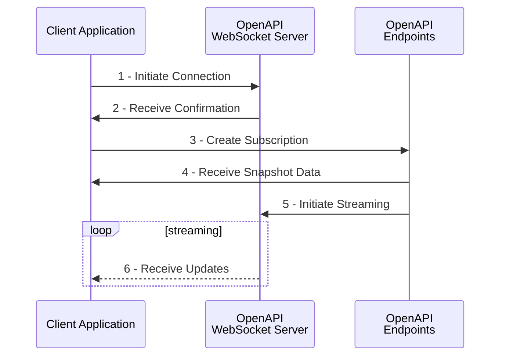

# Streaming with WebSockets

??? abstract
    WebSockets are super useful.

---

## Introduction

The OpenAPI WebSocket implementation is based on standard protocols ...

## High-Level Overview of WebSocket Streaming



The sequence above represents the standard flow to create a new WebSocket connection and subscribe to streaming data. It involves the following processes:

1. **Initiate Connection.** The client application creates a WebSocket connection by sending a request to the OpenAPI WebSocket Server (or 'streaming server', which is located on `streaming.saxobank.com`). This request follows standard WebSocket protocol and includes two additional elements:

    - The `ContextId` parameter: a unique ID that identifies this connection. This ID is generated by the client application. Every API interaction that involves streaming should include this ID (see step 3 below). Example: `ContextId=MyApp123abc`. Make sure to create a sufficiently long random string to prevent potential clashes with other applications. The streaming server will respond with `HTTP 409 Conflict` if the ContextId is already used for a different connection.
    - The `Authorization` header: standard authorization header containing a valid access token. Can also be sent as parameter if the client-side library does not support initiating WebSocket connections with custom headers. Example: `Authorization=Bearer%20[token]`.

    ```HTTP tab="With Auth Header"
    GET /sim/openapi/streamingws/connect?ContextId=[ID] HTTP/1.1
    Connection: Upgrade
    Upgrade: WebSocket
    Sec-WebSocket-Key: [auto-generated key]
    Sec-WebSocket-Version: 13
    Authorization: Bearer [token]
    Host: streaming.saxobank.com
    ```

    ```HTTP tab="With Auth Parameter"
    GET /sim/openapi/streamingws/connect?ContextId=[ID]&Authorization=Bearer%20[token] HTTP/1.1
    Connection: Upgrade
    Upgrade: WebSocket
    Sec-WebSocket-Key: [auto-generated key]
    Sec-WebSocket-Version: 13
    Host: streaming.saxobank.com
    ```

2. **Receive Confirmation.** The streaming server responds with a 101 Switching Protocols response code to confirm that the connection has been established. This response includes a `Connection: Upgrade` and a `Upgrade: websocket` header, as well as a hash of the key provided by the client in the `Sec-WebSocket-Accept` header (which prevents caching proxies from interfering with the handshake request).

    ```HTTP
    HTTP/1.1 101 Switching Protocols
    Upgrade: websocket
    Connection: Upgrade
    Cache-Control: private
    Sec-WebSocket-Accept: [hashed key]
    ```

3. **Create Subscription.** At this point, a connection is established but no subscriptions have been created (the connection is empty). In order to initiate a subscription, the client application sends a POST request to a `.../subscriptions` endpoint in the OpenAPI.[^1] For example, a price subscription for the EURUSD Forex cross (UIC 21) can be created by sending the following POST request to the `trade/v1/infoprices/subscriptions` endpoint:

    ```HTTP hl_lines="3 14 15"
    POST /sim/openapi/trade/v1/infoprices/subscriptions HTTP/1.1
    Host: gateway.saxobank.com
    Authorization: Bearer [token]
    Content-Type: application/json
    Accept: */*
    Cache-Control: no-cache
    Accept-Encoding: gzip, deflate
    Content-Length: 127
    {
      "Arguments": {
        "Uics": "21",
        "AssetType": "FxSpot"
      },
      "ContextId": "MyConnectionID",
      "ReferenceId": "SubscriptionReference"
    }
    ```

    Notice that this subscription request must contain a valid access token, and identifies the existing subscription using the `ContextId` field, which must match the ID set on the initial connection request (see step 1 above). This individual subscription is identified by its `ReferenceId`, which is set by the client application and can be used to adjust or cancel the subscription (without disconnecting the WebSocket).

4. **Receive Snapshot Data.** The OpenAPI responds with `HTTP 201 Created` to signal that the client subscribed successfully. In the response to the subscription request, the OpenAPI sends out a snapshot of the current state of the data requested by the client application. This is the starting point of the subscription and includes *all* available fields.

    ```JSON
    {
      "ContextId": "MyConnectionID",
      "Format": "application/json",
      "InactivityTimeout": 30,
      "ReferenceId": "SubscriptionReference",
      "RefreshRate": 1000,
      "Snapshot": {
        "Data": [
          {
            "AssetType": "FxSpot",
            "LastUpdated": "2020-02-11T09:38:20.553000Z",
            "PriceSource": "SBFX",
            "Quote": {
              "Amount": 100000,
              "Ask": 1.09143,
              "Bid": 1.09141,
              "DelayedByMinutes": 0,
              "ErrorCode": "None",
              "Mid": 1.09142,
              "PriceSource": "SBFX",
              "PriceSourceType": "Firm",
              "PriceTypeAsk": "Tradable",
              "PriceTypeBid": "Tradable"
          },
          "Uic": 21
          }
        ]
      },
      "State": "Active"
    }
    ```

5. **Initiate Streaming.** Behind the scenes, the OpenAPI automatically instructs the streaming server to start sending updates on the WebSocket connection for the new subscription. These updates will be buffered if the subscription request is received before the WebSocket connection is created to ensure consistency on the client side.

6. **Receive Updates.** The client now receives data messages on the WebSocket connection. These messages are sent as a stream over a series of binary WebSocket frames. Each WebSocket frame can contain multiple data messages, and data messages can be split over several WebSocket frames, in which case a continuation frame follows. The `FIN` bit on each frame indicates whether the contained data completes a data message. Frame B in the below diagram only contains part of data message 3, which should be completed using the first half of frame C.

    ```
                        +---------------+-------------+-------------+
    WebSocket frame:    |   A     FIN=1 |   B   FIN=0 |   C   FIN=1 |
                        +-------+-------+-------------+-----+-------+
    Data message:       |   1   |   2   |         3         |   4   |
                        +-------+-------+-------------------+-------+
    ```

    The binary data contained in the WebSocket frames needs to be decoded in the client application (see the byte layout below). The frame includes a the `RefrenceId` of the subscription that it belongs to. The data messages are always in JSON format and contain *only* fields that changed (so-called **'delta updates'**).[^2] For instance, the first update message for the EURUSD price subscription created above could look like this:

    ```JSON
    [
      {
        "LastUpdated": "2020-02-11T09:38:30.972000Z",
        "Quote": {
          "Ask": 1.09148,
          "Bid": 1.09147,
          "Mid": 1.091475
        },
        "Uic": 21
      }
    ]
    ```

    Notice that the *only* static element in this message is the `Uic` field, which is required to determine which object should be updated on the client side. The updated fields are merged with the snapshot received in step 4 to create a new 'current state' of the EURUSD price:

    ```JSON hl_lines="11 15 16 19"
    {
      "ContextId": "MyConnectionID",
      "Format": "application/json",
      "InactivityTimeout": 30,
      "ReferenceId": "SubscriptionReference",
      "RefreshRate": 1000,
      "Snapshot": {
        "Data": [
          {
            "AssetType": "FxSpot",
            "LastUpdated": "2020-02-11T09:38:30.972000Z",
            "PriceSource": "SBFX",
            "Quote": {
              "Amount": 100000,
              "Ask": 1.09148,
              "Bid": 1.09147,
              "DelayedByMinutes": 0,
              "ErrorCode": "None",
              "Mid": 1.091475,
              "PriceSource": "SBFX",
              "PriceSourceType": "Firm",
              "PriceTypeAsk": "Tradable",
              "PriceTypeBid": "Tradable"
          },
          "Uic": 21
          }
        ]
      },
      "State": "Active"
    }
    ```


## Decoding Data Messages

The client application is expected to decode the byte layout of each individual messages, which follows the below pattern:

| Byte index     | Size (bytes) | Description | Example value |
|----------------|--------------|-------------|---------------|
| 0              | 8            | **Message identifier** <br/> 64-bit little-endian unsigned integer uniquely identifying each message, starting at `1` for the first message. | `31` |
| 8              | 2            | **Reserved** <br/> Reserved bytes for future use - to be ignored by the client application. | |
| 10             | 1            | **Reference ID size** `RefSize` <br/> Number of bytes that make up the Reference ID of the subscription that this message belongs to. | `15` |
| 11             | `RefSize`    | **Reference ID** <br/> ASCII-encoded Reference ID corresponding to the subscription that this message belongs to or to pre-defined control messages (see below). | `SubscriptionReference`  or `_heartbeat` |
| 11 + `RefSize` | 1            | **Payload format** <br/> 8-bit unsigned integer signaling the format of the payload. Value will be `0` for data messages and control messages to signal payload is a UTF-8 encoded text string containing JSON. | `0` |
| 12 + `RefSize` | 4            | **Payload size** `PlSize` <br/> 32-bit little-endian unsigned integer indicating the size of the payload contained in this message. | `108` |
| 16 + `RefSize` | `PlSize`     | **Message payload** <br/> UTF-8 encoded message payload, which decodes to a string representing a JSON object. This string should be deserialized into a JSON object. | *See update message above* |


Note:

- One Streaming connection - multiple subscriptions
- WebSockets only used for reading - sending messages are ignored
- Buffering on POST request


[^1]: Strictly speaking, the exact order of steps 1-3 is not important as the subscription request will automatically buffer updates until the corresponding WebSocket connection is created.
[^2]: Delta updates offer a significant optimization in WebSocket streaming because static fields are never sent more than once, reducing message payload size. It does however require the client-side application to merge the update with the earlier received snapshot (i.e. keep state).