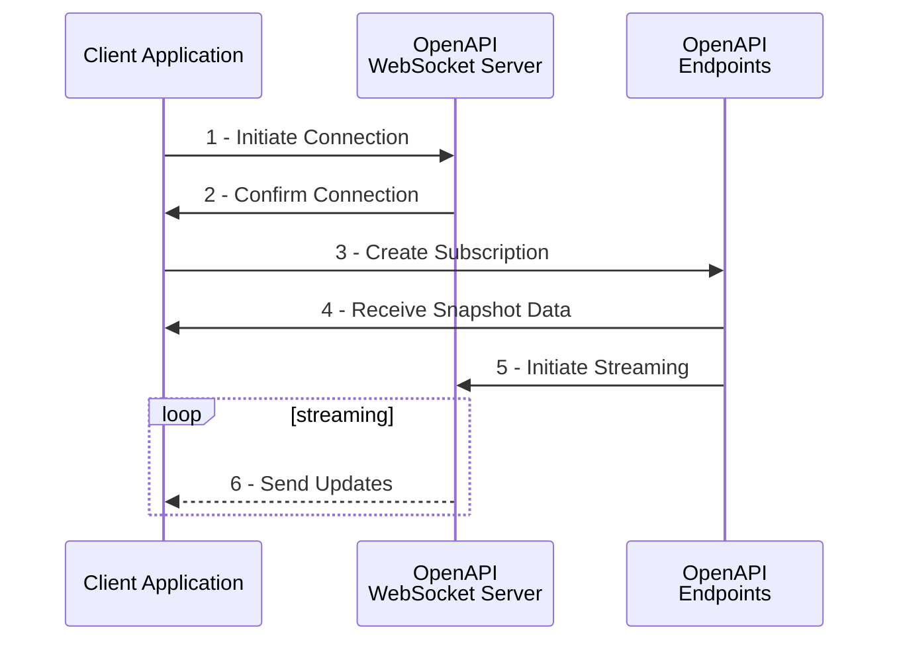

# Streaming with WebSockets

??? abstract
    WebSockets are super useful.

---

The OpenAPI WebSocket implementation is based on standard protocols ...

## High-Level Overview of WebSocket Streaming



The sequence above represents the standard flow to create a new WebSocket connection and subscribe to streaming data. It involves the following 6 phases:

1. **Initiate Connection.** The client application creates a WebSocket connection by sending a request to the OpenAPI streaming server. This request follows standard WebSocket protocol and includes two additional elements:

    - The `ContextId` parameter: a unique ID that identifies this connection. This ID is generated by the client application. Every API interaction that involves streaming should include this ID (see step 3 below). Example: `ContextId=MyApp123abc`.
    - The `Authorization` header: standard authorization header containing a valid access token. Can also be sent as parameter if the client-side library does not support initiating WebSocket connections with custom headers. Example: `Authorization=Bearer%20[token]`

    ```HTTP tab="With Auth Header"
    GET /sim/openapi/streamingws/connect?contextId=[ID] HTTP/1.1
    Connection: Upgrade
    Upgrade: WebSocket
    Sec-WebSocket-Key: [auto-generated key]
    Sec-WebSocket-Version: 13
    Authorization: Bearer [token]
    Host: streaming.saxobank.com
    ```

    ```HTTP tab="With Auth Parameter"
    GET /sim/openapi/streamingws/connect?contextId=[ID]&Authorization=Bearer%20[token] HTTP/1.1
    Connection: Upgrade
    Upgrade: WebSocket
    Sec-WebSocket-Key: [auto-generated key]
    Sec-WebSocket-Version: 13
    Host: streaming.saxobank.com
    ```

2. **Confirm Connection.** The streaming server responds with a 101 Switching Protocols response code to confirm that the connection has been established. This response includes a `Connection: Upgrade` and a `Upgrade: websocket` header, as well as a hash of the key provided by the client in the `Sec-WebSocket-Accept` header (which prevents caching proxies from interfering with the handshake request).

    ```HTTP
    HTTP/1.1 101 Switching Protocols
    Upgrade: websocket
    Connection: Upgrade
    Cache-Control: private
    Sec-WebSocket-Accept: [hashed key]
    ```

3. **Create Subscription.** At this point, a connection is established but no subscriptions have been created (the connection is empty). In order to initiate a subscription, the client application sends a POST request to a `.../subscriptions` endpoint in the OpenAPI.[^1] For example, a price subscription for the EURUSD Forex cross (UIC 21) can be created by sending the following POST request to the `trade/v1/infoprices/subscriptions` endpoint:

    ```HTTP hl_lines="3 14 15"
    POST /sim/openapi/trade/v1/infoprices/subscriptions HTTP/1.1
    Host: gateway.saxobank.com
    Authorization: Bearer [token]
    Content-Type: application/json
    Accept: */*
    Cache-Control: no-cache
    Accept-Encoding: gzip, deflate
    Content-Length: 127
    {
      "Arguments": {
        "Uics": "21",
        "AssetType": "FxSpot"
      },
      "ContextId": "MyConnectionID",
      "ReferenceId": "SubscriptionReference"
    }
    ```

    Notice that this subscription request must contain a valid access token, and identifies the existing subscription using the `ContextId` field, which must match the ID set on the initial connection request (see step 1 above). This individual subscription is identified by its `ReferenceId`, which is set by the client application. This ID is used to modify or cancel this individual subscription.

4. **Receive Snapshot Data.** In the response to subscription request, the OpenAPI sends out a snapshot of the current state of the data requested by the client application. This is the starting point of the information that will be send out and includes *all* available fields.

    ```JSON
    {
      "ContextId": "MyConnectionID",
      "Format": "application/json",
      "InactivityTimeout": 30,
      "ReferenceId": "SubscriptionReference",
      "RefreshRate": 1000,
      "Snapshot": {
        "Data": [
          {
            "AssetType": "FxSpot",
            "LastUpdated": "2020-02-10T19:44:40.519000Z",
            "PriceSource": "SBFX",
            "Quote": {
              "Amount": 100000,
              "Ask": 1.09143,
              "Bid": 1.09141,
              "DelayedByMinutes": 0,
              "ErrorCode": "None",
              "Mid": 1.09142,
              "PriceSource": "SBFX",
              "PriceSourceType": "Firm",
              "PriceTypeAsk": "Tradable",
              "PriceTypeBid": "Tradable"
          },
          "Uic": 21
          }
        ]
      },
      "State": "Active"
    }
    ```


Note:

- One Streaming connection - multiple subscriptions
- Buffering on POST request


[^1]: Strictly speaking, the exact order of steps 1-3 is not important as the subscription request will automatically buffer updates until the corresponding WebSocket connection is created.