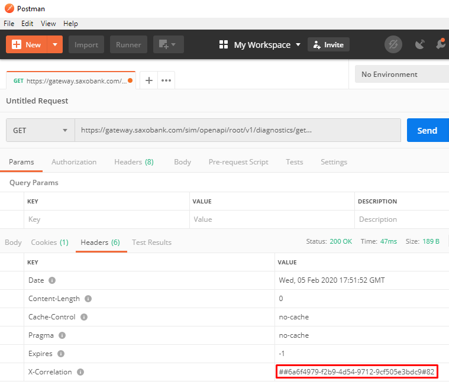

# Requesting Support the Right Way

??? abstract
    In order for Saxo's support team to provide quality development support, we need your help to perform debugging and provide us with as much information as you can.

---

As mentioned on the [welcome page](index.md), Saxo's OpenAPI is a complex piece of machinery. The support team is available to provide assistance whenever required, however do bear in mind that providing proper support *relies in large part on the information provided by you*. It is recommended to follow the below steps to analyze the issue you are facing.

## Step 1: Basic Diagnosis

Although it is of course possible that the difficulties you are facing are caused by the OpenAPI, requests are often received from developers that are digging into tracebacks originating from a flaw in their *own* application. If you believe the OpenAPI is the source of the problem, please verify your suspicion by answering the below 3 questions:

1. **Analyze the traceback** (or logs) provided by your development environment. Does it indicate that all processes are working fine within the app and the issue is in fact caused when a request is sent to (or received from) the OpenAPI?
2. **Extract the request** at point of failure: pluck the the misbehaving HTTP request out of context including its headers, parameters, body, and cookies. You can use a debugging proxy  like [Fiddler](https://www.telerik.com/fiddler) to simplify this process. Does the request conform to the [basic OpenAPI HTTP request requirements]?
3. **Verify** the request using an API debugging tool such as [Postman](https://www.getpostman.com/), or directly from the command line using `curl`. Does this result in the same response/error?

## Step 2: Use the Search & Check the FAQ

The search tool at the top of this window is a quick and powerful way to **scan every bit of information** on this website. Make sure to use different combinations of keywords if you are not able to find the information you are looking for and [check the FAQ](basics/faq/index.md) to see if your specific question has come up before. FAQ articles are added progressively for every question received by OpenAPI support.

## Step 3: Email OpenAPI Support

If all of the above did not help you find an answer, the support team would be glad to receive a message on [openapisupport@saxobank.com](mailto:openapisupport@saxobank.com). Please bear in mind you can **help us help you** by including *as many details as possible* in your inquiry. The OpenAPI receives millions of requests every day, so it is virtually impossible to even begin to provide support if all we have is an email address and a message such as "it doesn't work".

Here's how to **request support like a pro**:

1. Include **a clear description** of the issue/bug/problem/obstacle that you are facing along the lines of:
> "I am trying to achieve [ *business requirement* ] so I sent a request to the OpenAPI such as this [ *request example* ] and I expected to receive [ *desired outcome* ] but instead I got [ *unexpected behavior* ]."
2. Add the **details of the request** that results in the error. If you followed [Step 1](#step-1-basic-diagnosis), you will have this at hand already. Make sure to include:
    - The URL (including parameters), request method, and (if applicable) the request body
    - Any headers or cookies that are sent with the request
    - The timestamp of the request
    - The `UserId` or `ClientId` associated with the request
    *(if you are using a top-level client, make sure to include both the top-level and target client ID)*
3. And finally, add the **details of the response**:
    - The response code and body
    - The timestamp of the response
    - **Most importantly**: the `X-Correlation` header included in the response (see below)

!!! tip
    The `X-Correlation` header is an internal Saxo identifier which we can track throughout our systems. Make sure to send us this value!

### About the `X-Correlation` Header

Imagine you are about to send a support request and you can only include **1 piece of information**, what should it be? Answer: the `X-Correlation` header. The OpenAPI sends out correlation headers with *every response*, which encode important contextual details regarding your requests and allows for **direct log queries**. It goes without saying that this is by far the most useful info our team could receive from you!

If you've tried the request demonstrated in [the code block on one of the earlier pages](usage.md#sample-code), you may have noticed that the `X-Correlation` header was indeed included in the response headers from the OpenAPI, as shown in the below screenshot from Postman:

{: style="height:auto;width:auto"}